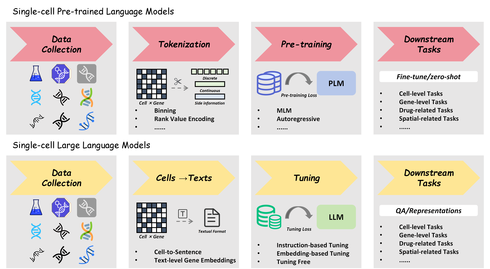

# 🚀 Awesome-Single-cell-Foundation-Models 🚀
A list of foundation language model for single-cell biology papers

      

## ❖  Paper List

| Tilte | Category | Paper Link | Year | Publish |
| --- | --- | --- | --- | --- |
| scBERT as a large-scale pretrained deep language model for cell type annotation of single-cell RNA-seq data | scPLM | [link](https://www.nature.com/articles/s42256-022-00534-z) | 2022 | Nature Machine Intelligence |
| Large-Scale Cell Representation Learning via Divide-and-Conquer Contrastive Learning | scPLM | [link](https://arxiv.org/abs/2306.04371) | 2023 | arXiv |
| Universal Cell Embeddings: A Foundation Model for Cell Biology | scPLM | [link](https://www.biorxiv.org/content/10.1101/2023.11.28.568918v2) | 2023 | bioRxiv |
| Transfer learning enables predictions in network biology | scPLM | [link](https://www.nature.com/articles/s41586-023-06139-9) | 2023 | Nature |
| CellPLM: Pre-training of Cell Language Model Beyond Single Cells | scPLM | [link](https://openreview.net/forum?id=BKXvPDekud) | 2024 | ICLR |
| Large-scale foundation model on single-cell transcriptomics | scPLM | [link](https://www.nature.com/articles/s41592-024-02305-7) | 2024 | Nature Methods |
| Nicheformer: a foundation model for single-cell and spatial omics | scPLM | [link](https://www.biorxiv.org/content/10.1101/2024.04.15.589472v1) | 2024 | bioRxiv |
| tGPT: Generative pretraining from large-scale transcriptomes | scPLM | [link](https://www.sciencedirect.com/science/article/pii/S2589004223006132) | 2024 | iScience |
| scGPT: toward building a foundation model for single-cell multi-omics using generative AI | scPLM | [link](https://www.nature.com/articles/s41592-024-02201-0) | 2024 | Nature Methods |
| LangCell: Language-Cell Pre-training for Cell Identity Understanding | scPLM | [link](https://arxiv.org/abs/2405.06708) | 2024 | ICML |
| Cell-ontology guided transcriptome foundation model | scPLM | [link](https://arxiv.org/abs/2408.12373) | 2024 | NeurIPS |
| scMulan: A Multitask Generative Pre-trained Language Model for Single-Cell Analysis | scPLM | [link](https://www.biorxiv.org/content/10.1101/2024.01.25.577152v1) | 2024 | bioRxiv |
| GeneCompass: deciphering universal gene regulatory mechanisms with a knowledge-informed cross-species foundation model | scPLM | [link](https://www.nature.com/articles/s41422-024-01034-y) | 2024 | Cell Research |
| CellFM: a large-scale foundation model pre-trained on transcriptomics of 100 million human cells | scPLM | [link](https://www.nature.com/articles/s41467-025-59926-5) | 2025 | Nature Communications |
| scPRINT: pre-training on 50 million cells allows robust gene network predictions | scPLM | [link](https://www.nature.com/articles/s41467-025-58699-1) | 2025 | Nature Communications |
| scInterpreter: a knowledge-regularized generative model for interpretably integrating scRNA-seq data | scLLM | [link](https://bmcbioinformatics.biomedcentral.com/articles/10.1186/s12859-023-05579-4) | 2023 | BMC Bioinformatics |
| Cell2Sentence: Teaching Large Language Models the Language of Biology | scLLM | [link](https://icml.cc/virtual/2024/poster/34580) | 2024 | ICML |
| ChatCell: Facilitating Single-Cell Analysis with Natural Language | scLLM | [link](https://arxiv.org/abs/2402.08303) | 2024 | arXiv |
| Simple and effective embedding model for single-cell biology built from ChatGPT | scLLM | [link](https://www.nature.com/articles/s41551-024-01284-6) | 2024 | Nature Biomedical Engineering |
| scELMo: Embeddings from Language Models are Good Learners for Single-cell Data Analysis | scLLM | [link](https://www.biorxiv.org/content/10.1101/2023.12.07.569910v3) | 2024 | bioRxiv |
| CELLama: Foundation Model for Single Cell and Spatial Transcriptomics by Cell Embedding Leveraging Language Model Abilities | scLLM | [link](https://www.biorxiv.org/content/10.1101/2024.05.08.593094v1) | 2024 | bioRxiv |
| scChat: A Large Language Model-Powered Co-Pilot for Contextualized Single-Cell RNA Sequencing Analysis | scLLM | [link](https://www.biorxiv.org/content/10.1101/2024.10.01.616063v1) | 2024 | bioRxiv |

---

🤗 Welcome to contribute to this repo! You can create a pull request or email me at zfkarl1998@gmail.com.
